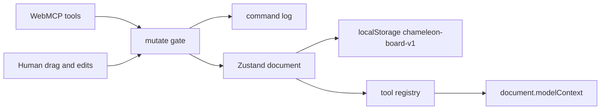

# Chameleon

**Software that grows its own API.** Chameleon is a near-blank web page that an AI agent turns into working software. A wedding planner, a job-search tracker, or a health log can appear live in conversation, using [WebMCP](https://github.com/webmachinelearning/webmcp) (`document.modelContext` / `navigator.modelContext`) layout, data, and styling tools built on a six-widget grammar: table, kanban, checklist, chart, note, and form.

When the agent builds a form and calls `create_form_tool`, Chameleon registers a new WebMCP tool such as `log_blood_sugar`. That tool's input schema comes from the form's fields. The page's tool list grows as the agent builds, and minted tools persist across reloads. You can drag, resize, and edit everything by hand. Every mutation, human or agent, lands in one command log that powers undo and gives the agent ground truth. There is no backend and no auth. All state stays in the browser.

Built for the [OpenAI WebMCP Challenge](https://webmcp.devpost.com/) (deadline Sep 3, 2026).

[MIT](LICENSE) · live app: [chameleon-webmcp.ryan-970.workers.dev](https://chameleon-webmcp.ryan-970.workers.dev)

## Try it with an agent

This is the judge path.

1. Open [https://chameleon-webmcp.ryan-970.workers.dev](https://chameleon-webmcp.ryan-970.workers.dev) in ChatGPT's desktop-app browser. That host exposes `document.modelContext`.
2. If you are testing in Chrome Canary, open `chrome://flags`, search `webmcp`, enable the flag (currently `#enable-webmcp-testing`), then reload the live URL. Use the Model Context Tool Inspector to confirm the 15 static tools.
3. Paste one of the prompts below. First load and Reset canvas show an empty board with those prompts. Choose **Load a sample board** if you want a note and table without an agent.

**Wedding planner**

```
I'm planning my wedding for next June — about 80 guests. Set this page up for me.
```

**Job search**

```
Switch gears. I'm tracking my job search.
```

**Health log**

```
I'm managing my type 2 diabetes. I want to log blood sugar readings and see trends.
```

Stable Chrome without WebMCP still loads the app. You will see a dismissable banner and a token that reads `15 tools ready`. Hand edits still work. Agents need ChatGPT's browser or Canary with the flag.

On viewports narrower than 700px the grid stacks to one column and drag/resize is off, so a phone does not scramble stored layout.

## What WebMCP tools it exposes

The contract lives in [docs/01-tool-spec.md](docs/01-tool-spec.md). These 15 static tools register on boot.

| Tool | What it does |
|---|---|
| `describe_current_state` | Returns the board snapshot, unfinished work, and `stateVersion`. Call this first. |
| `add_widget` | Adds a table, kanban, checklist, chart, note, or form. |
| `bind_data` | Sets the field schema on a data widget. |
| `add_rows` | Appends up to 50 validated rows. |
| `create_form_tool` | Mints a persistent tool from a form. Required after you add a form for repeated entries. |
| `update_widget` | Changes title, config, or position. |
| `read_widget_data` | Pages through one widget's rows. |
| `get_activity_log` | Returns human and agent commands. |
| `remove_widget` | Deletes a widget and any minted tool it owns. |
| `update_rows` | Patches rows by id. |
| `delete_rows` | Deletes rows by id. |
| `set_layout` | Moves or resizes widgets on the 12-column grid. |
| `set_theme` | Sets theme, mode, density, or board title. |
| `remove_minted_tool` | Unregisters a minted tool. Static tools cannot be removed. |
| `undo` | Reverts the newest mutations, human or agent. |

**Minted tools.** After `create_form_tool` on a form with `reading` (number, required) and `context` (`fasting` or `after_meal`), the page registers `log_blood_sugar`. One call appends one validated row. The form header shows a ⚡ token with that name. The tool survives reload until the form is deleted or `remove_minted_tool` runs.

## Run locally

```bash
npm install
npm run dev        # http://localhost:4711
npm test
npm run deploy     # wrangler → Cloudflare Workers
```

`npm run dev` binds port 4711. Isolated verification uses `control-chameleon launch` on a different port.

## How state moves



Human drags and agent tool calls share one Immer `produceWithPatches` gate. That gate writes the command log, inverse-patch undo, and `stateVersion`. Persist version is 3. Do not bump it unless the document shape changes.

## Docs

| Doc | Contents |
|---|---|
| [docs/01-tool-spec.md](docs/01-tool-spec.md) | 15 static tools, schemas, errors, minted-tool lifecycle |
| [docs/02-widget-grammar.md](docs/02-widget-grammar.md) | Six widget types and `describe_current_state` payload |
| [docs/03-repo-scaffold.md](docs/03-repo-scaffold.md) | Directory layout and module contracts |
| [docs/04-build-plan.md](docs/04-build-plan.md) | Day-by-day plan through Sep 3 |
| [docs/05-demo-script.md](docs/05-demo-script.md) | Timed demo video script |
| [docs/06-submission.md](docs/06-submission.md) | Devpost text, license, deploy, judge checklist |

## License

[MIT](LICENSE)
